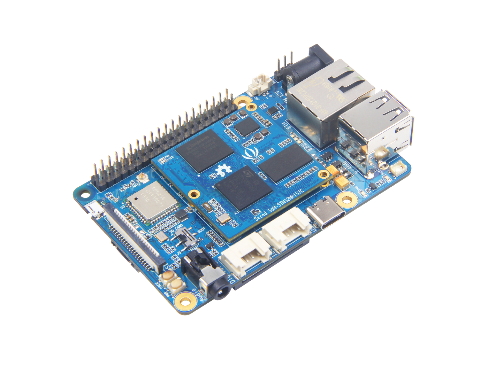

# ODYSSEY - STM32MP157C Support

This is the base Nerves System configuration for the [ODYSSEY - STM32MP157C](https://www.seeedstudio.com/ODYSSEY-STM32MP157C-p-4464.html).


This image is from [Seeed](https://www.seeedstudio.com/ODYSSEY-STM32MP157C-p-4464.html).

| Feature              | Description                                                 |
| -------------------- | ----------------------------------------------------------- |
| CPU                  | 650MHz Dual-core Arm-Cortex-A7 with Cortex-M4 integrated    |
| Memory               | 512MB DDR3 RAM                                              |
| Storage              | 4GB EMMC and MicroSD                                        |
| Linux kernel         | 5.10 w/ RCN patches                                         |
| IEx terminal         | UART `ttySTM0`                                              |
| GPIO, I2C, SPI       | Yes - [Elixir Circuits](https://github.com/elixir-circuits) |
| ADC                  | No                                                          |
| PWM                  | Yes, but no Elixir support                                  |
| UART                 | ttySTM0, ttySTM2                                            |
| Display              | MIPI DSI display interface, not supported yet               |
| Camera               | DVP camera interface, not supported yet                     |
| Ethernet             | Yes (eth0)                                                  |
| WiFi                 | Yes (wlan0)                                                 |
| Bluetooth            | Yes (hci0), not confirmed yet                               |
| Audio                | 3.5mm audio interface, not supported yet                    |
| RTC                  | 3VRTC battery interface                                     |


## Using

This port currently only runs off a SD card.

The most common way of using this Nerves System is create a project with `mix
nerves.new` and add `stm32mp157c_odyssey` references where needed and in a similar way
to the default systems like `bbb`, etc. Then export `MIX_TARGET=stm32mp157c_odyssey`.
See the [Getting started guide](https://hexdocs.pm/nerves/getting-started.html#creating-a-new-nerves-app)
for more information.

If you need custom modifications to this system for your device, clone this
repository and update as described in [Making custom systems](https://hexdocs.pm/nerves/systems.html#customizing-your-own-nerves-system).


## Networking

The board has one 1 Gbps Ethernet interface and one WiFi interface. Here's an example `:vintage_net`
configuration that enables both of them:

For WiFi configuration, see. https://hexdocs.pm/vintage_net/cookbook.html#normal-password-protected-wifi-wpa2-psk

```elixir
config :vintage_net,
  regulatory_domain: "US",
  config: [
    {"eth0", %{type: VintageNetEthernet, ipv4: %{method: :dhcp}}},
    {"wlan0", %{type: VintageNetWiFi}}
  ]
```

## Serial

This board has one uart and two usart.

| name as tty | name as serial | dts info   | dts info | for what                           |
| ----------- | -------------- | ---------- | -------- | ---------------------------------- |
| ttySTM0     | serial0        | 0x40010000 | uart4    | for debug uart besides barrel jack |
| ttySTM1     | serial1        | 0x5c000000 | usart1   | for AP6236, so can't be used       |
| ttySTM2     | serial2        | 0x4000e000 | usart2   | for raspi compatible uart          | 

## GPIO

GPIO pins for circuits_gpio can be calculated according to the following formula,

```
pin number = <gpio chip name> * 16 + offset
# gpio chip name is A as 0, B as 1 ...
```

So pin number of below image GPIO_H12 is 124, 7 * 16 + 12.


## Known limitations

### eth0 MAC address changes at each boot

This is because the vendor does not provide it.

### Can't read input when using circuits_gpio

See below issue.

[Can't read input until after the output has been configured once when using circuits_gpio](https://github.com/b5g-ex/nerves_system_stm32mp157c_odyssey/issues/3)

